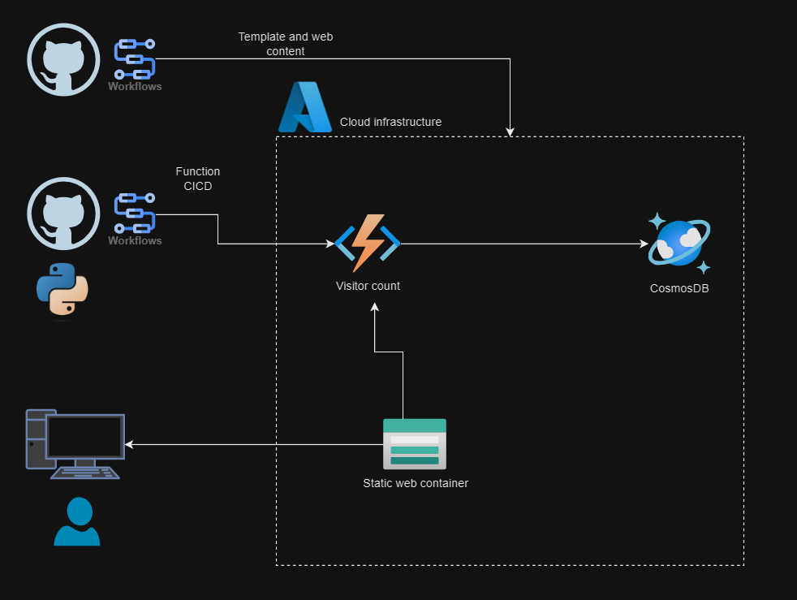

# Azure Resume Challenge

## Overview
This project is submitted for the Azure Resume Challenge. I've created a demo website hosted on Azure.

## Features
- **Resume Website**: A static website with HTML, Javascript and CSS.
- **Continuous Deployment**: Implemented CI/CD pipelines using GitHub Actions for automated deployment of changes to the website.
- **Azure Services Used**:
  - Azure App Service: Hosted the static website. # comment
  - Azure Storage: Stored website assets such as images, CSS, and JavaScript files.
  - Azure Functions: Implemented serverless functions connecting to CosmosDB for track visitor count.
  - GitHub Actions: Configured pipelines for automated deployment of Web content and Azure infrastucture.
  - Azure Cosmos DB: Stored the visitor count.

## Project Structure
- **src/**: Contains the source code for the website.
- **.github/workflows/**: CI/CD pipeline configuration file.
- **README.md**: This file.
- **infra/**: ARM template of Azure resources and parameters.
- **Tests/**: Python tests for file format validations.
- **improvements.md**: Improvements and limitaitons.
- [Azure-resume-project-functions](https://github.com/deelakaperera/Azure-resume-project-functions): Repository for Azure function.

## Deployment Steps
1. Clone this repository to your local machine.
2. Navigate to the `src/` directory.
3. Modify the HTML, CSS, and JavaScript files to customize your resume website.
4. Create following secrets in your repository settings:
  - `AZURE_CREDENTIALS` - Crenedtials for Azure;
  Generate application with contributor role: 
  ```
  az ad sp create-for-rbac --name "<application-name>" --role contributor --scopes /subscriptions/<subscription-id>/resourceGroups/<resource-group-name> --json-auth
  ```
  Save the json output as credentials value.
  - `AZURE_RG` - Azure resourcegroup name
  - `AZURE_SUBSCRIPTION` - Azure subscription ID

5. Push your changes to the repository.

## Project diagram


### Azure resume challenge
https://cloudresumechallenge.dev/docs/the-challenge/azure/

